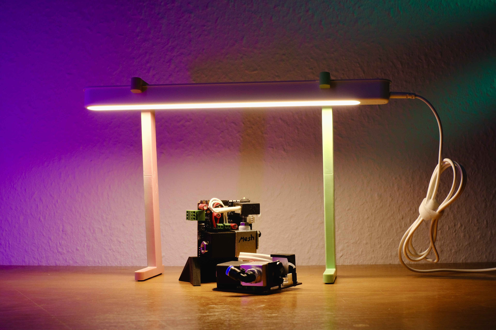
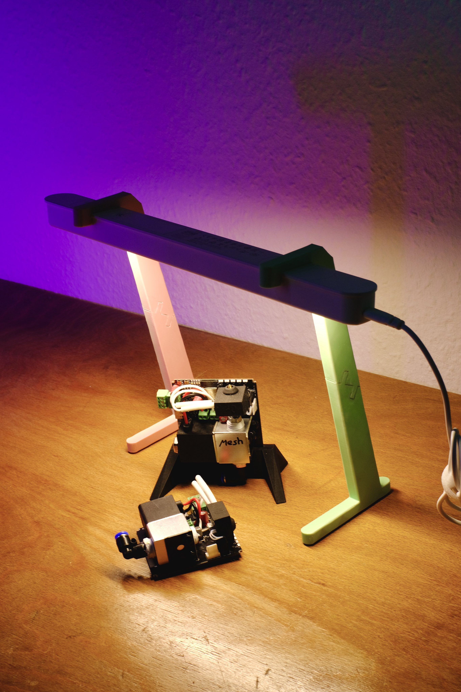
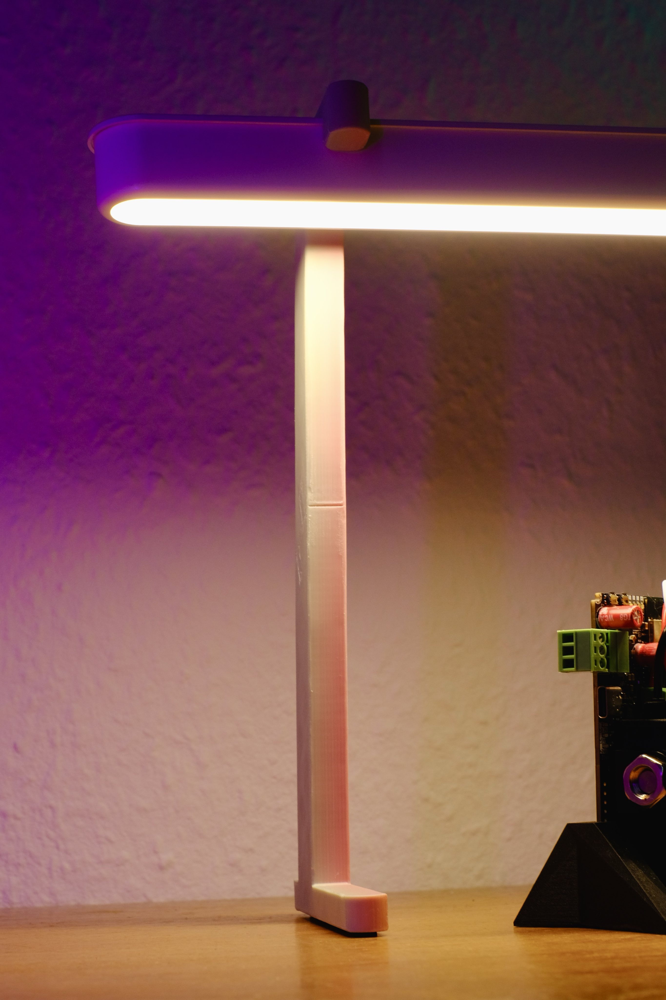
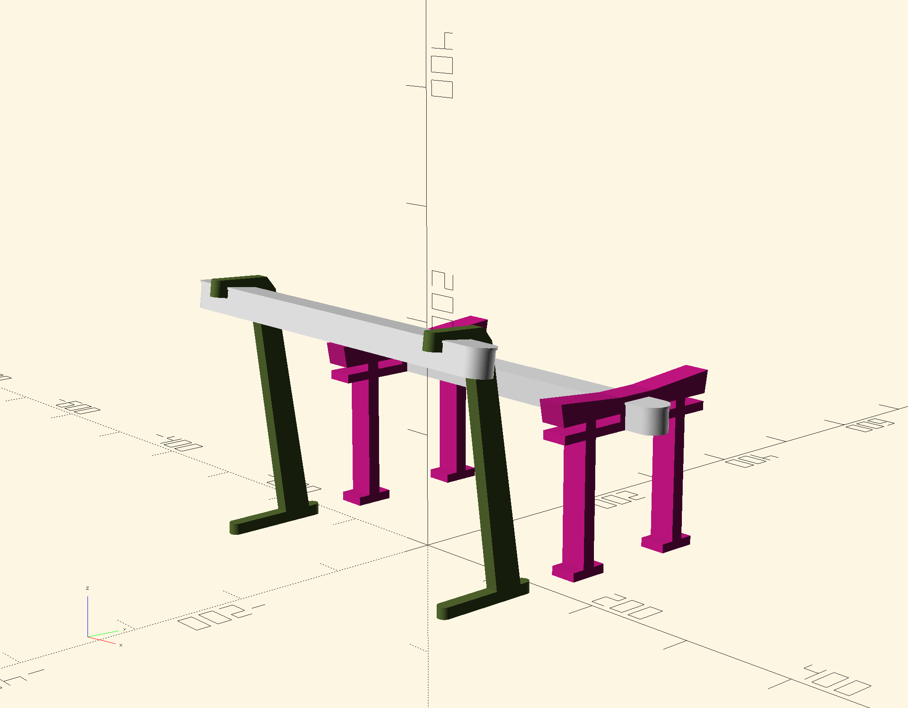
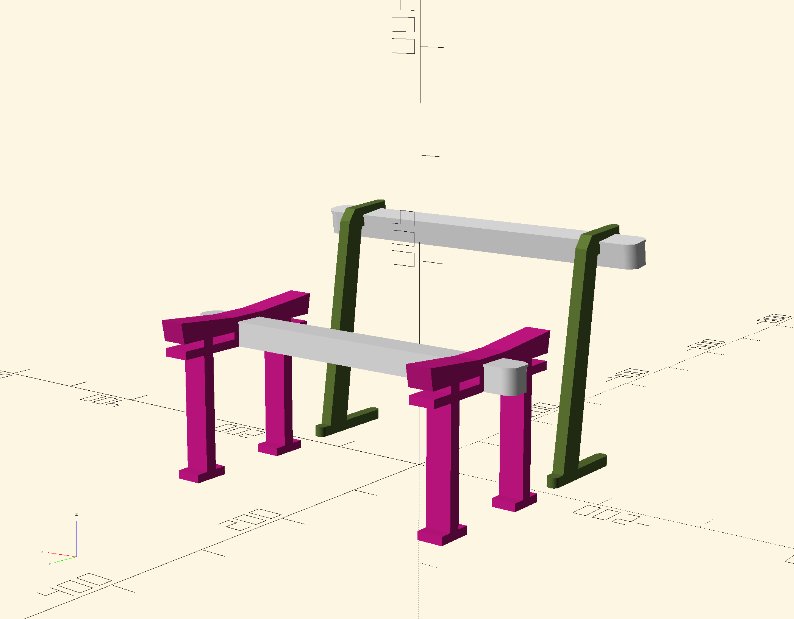

# rolfstorii

A 3D printed desktop stand for Ikeas Rolfstorp lamp. I created two versions, a Japanese Torii Gate style stand and a streetlight style one. I never printed the Torii stand, it felt too bulky.

<table>
	<tbody>
		<tr collspan="2">
			<td>
				
			</td>
		</tr>
		<tr>
			<td>
				
			</td>
			<td>
				
			</td>
		</tr>
		<tr>
			<td>
				
			</td>
			<td>
				
			</td>
		</tr>
	</tbody>
</table>